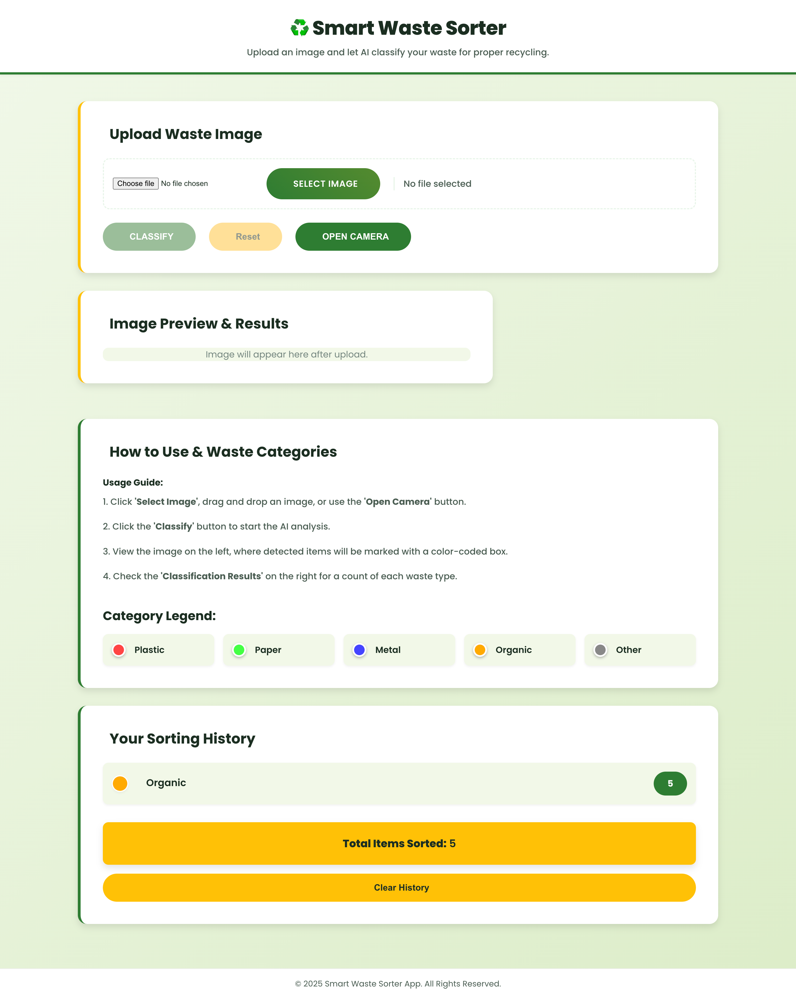

# 🗑️ Smart Waste Sorter

An AI-powered waste classification system built with YOLOv8, Flask, and React.

**Academic Project:** 4th Year, 1st Semester - Artificial Intelligence Lab

## 🌐 Live Demo

🚀 **Try it now:** [https://ai-waste-sorter.vercel.app/](https://ai-waste-sorter.vercel.app/)

## 📋 Overview

The Smart Waste Sorter is an end-to-end computer vision application that uses YOLOv8 object detection to identify and classify waste items into four categories:

- 🔴 **Plastic** - Bottles, containers, bags, packaging
- 🟢 **Paper** - Paper, cardboard, newspapers, magazines  
- 🔵 **Metal** - Cans, metal containers, aluminum foil
- 🟠 **Organic** - Food waste, fruits, vegetables

## 📸 Application Preview



## 🏗️ Architecture

```
┌─────────────────┐      HTTP Request      ┌──────────────────┐
│  React Frontend │ ───────────────────────> │  Flask Backend   │
│  (Port 3000)    │                          │  (Port 5000)     │
│                 │ <─────────────────────── │                  │
│  - File Upload  │      JSON Response       │  - YOLOv8 Model  │
│  - Visualization│                          │  - Inference     │
│  - Results      │                          │  - Class Mapping │
└─────────────────┘                          └──────────────────┘
```

## 🚀 Local Development Setup

### Prerequisites

- Python 3.11+
- Node.js 18+
- Docker (for backend)
- npm or yarn

### Backend Setup (Local Development)

1. **Navigate to backend folder:**
```bash
cd huggingface_flask_deploy
```

2. **Build and run with Docker:**
```bash
docker build -t waste-sorter-backend .
docker run -p 7860:7860 waste-sorter-backend
```

The backend will be available at `http://localhost:7860`

### Frontend Setup (Local Development)

1. **Navigate to the React app directory:**
```bash
cd smart-sorter-ui
```

2. **Install dependencies:**
```bash
npm install
```

3. **Create `.env.local` file:**
```bash
echo "REACT_APP_API_URL=http://localhost:7860" > .env.local
```

4. **Start the development server:**
```bash
npm start
```

The app will open automatically at `http://localhost:3000`

## 📖 Usage

1. **Open the application** in your browser at `http://localhost:3000`

2. **Click "Choose Image"** and select a photo containing waste items

3. **Click "Classify Waste"** to analyze the image

4. **View results:**
   - Bounding boxes around detected objects (color-coded by category)
   - Category counts showing the distribution of waste types
   - Original object labels with confidence scores

## 🧠 How It Works

### 1. Model Loading

- YOLOv8n model is downloaded automatically during Docker build
- Model is loaded when the Flask API starts
- Uses base YOLOv8n trained on COCO dataset (80 object classes)
- Model weights are cached for subsequent runs

### 2. Backend API (`huggingface_flask_deploy/app.py`)

The Flask backend provides three endpoints:

- `GET /` - Health check and API information
- `POST /predict` - Main classification endpoint
  - Accepts: multipart/form-data with 'image' field
  - Returns: JSON with detections, bounding boxes, and counts
- `GET /categories` - Returns available waste categories

**Class Remapping Logic:**

The backend intelligently maps the 80 COCO object classes to 4 waste categories:

```python
# Example mappings:
'bottle' → 'Plastic'
'apple' → 'Organic'  
'book' → 'Paper'
'scissors' → 'Metal'
```

For objects not in the predefined map, heuristic keyword matching is used.

### 3. Frontend UI (`smart-sorter-ui/`)

React application features:

- **File Upload**: Drag-and-drop or click to select images
- **Canvas Visualization**: Draws bounding boxes and labels on detected objects
- **Results Display**: Shows category counts and statistics
- **Responsive Design**: Works on desktop and mobile devices

## 📁 Project Structure

```
waste_sorter/
├── README.md                         # Project documentation
├── ai project proposal.pptx          # Academic project proposal
│
├── huggingface_flask_deploy/         # Backend (Hugging Face Spaces)
│   ├── app.py                        # Flask API
│   ├── Dockerfile                    # Docker configuration
│   ├── requirements.txt              # Python dependencies
│   └── README.md                     # Backend documentation
│
├── smart-sorter-ui/                  # Frontend (Vercel)
│   ├── src/
│   │   ├── App.js                    # Main React component
│   │   ├── App.css                   # Styling
│   │   └── index.js                  # Entry point
│   ├── public/                       # Static assets
│   └── package.json                  # Node dependencies
│
└── resources/                        # Project assets
    └── ss_smart_waste_fullpage.png   # App screenshot
```

## 🔧 Configuration

### Backend Configuration

Edit `huggingface_flask_deploy/app.py` to customize:

- **Model**: Change `YOLO('yolov8n.pt')` to use a different model
- **Confidence threshold**: Adjust `conf=0.25` in the predict function
- **Class mappings**: Modify the `CLASS_MAP` dictionary
- **Port**: Default is 7860 for Hugging Face Spaces

### Frontend Configuration

Edit `smart-sorter-ui/src/App.js` to customize:

- **API endpoint**: Set via `REACT_APP_API_URL` environment variable
- **Colors**: Modify `categoryColors` object
- **Timeout**: Adjust `timeout: 30000` for slower networks

Environment variables:
- **Local:** Create `.env.local` with `REACT_APP_API_URL=http://localhost:7860`
- **Production:** Set in Vercel dashboard

## 🧪 Testing

### Test Production Backend

```bash
curl https://rupontinova-smart-waste-sorter-api.hf.space/
```

Expected response:
```json
{
  "status": "online",
  "service": "Smart Waste Sorter API",
  "version": "1.0.0",
  "model": "YOLOv8n",
  "categories": ["Plastic", "Paper", "Metal", "Organic"],
  "deployed_on": "Hugging Face Spaces"
}
```

### Test Local Backend (if running)

```bash
curl http://localhost:7860/
```

### Test Image Classification

```bash
curl -X POST -F "image=@your_image.jpg" https://rupontinova-smart-waste-sorter-api.hf.space/predict
```

## 📊 API Reference

### POST /predict

**Request:**
- Method: `POST`
- Content-Type: `multipart/form-data`
- Body: `image` field with image file

**Response:**
```json
{
  "success": true,
  "detections": [
    {
      "box": [x1, y1, x2, y2],
      "label": "Plastic",
      "originalLabel": "bottle",
      "confidence": 0.87
    }
  ],
  "counts": {
    "Plastic": 2,
    "Organic": 1
  },
  "total_objects": 3
}
```

## 🐛 Troubleshooting

### "Cannot connect to backend" error

- Ensure Flask backend is running (`python3 app.py`)
- Check that port 5001 is not blocked by firewall
- On macOS, port 5000 is used by AirPlay - we use port 5001 instead
- Verify the backend URL in `App.js` matches your setup (should be port 5001)

### Model download fails

- Check internet connection
- Try downloading manually from [Ultralytics releases](https://github.com/ultralytics/assets/releases)
- Place the model file in the project root

### CORS errors

- Ensure `flask-cors` is installed
- Check CORS configuration in `app.py`
- Try clearing browser cache

### Deployment Notes

The application is deployed using:
- **Backend:** Docker container on Hugging Face Spaces (16GB RAM)
- **Frontend:** Static hosting on Vercel

For deployment details, check the respective folders:
- Backend: `huggingface_flask_deploy/`
- Frontend: `smart-sorter-ui/`

## 🌐 Live Deployments

The application is deployed and accessible online:

### Frontend (React)
- **Live URL:** [https://ai-waste-sorter.vercel.app/](https://ai-waste-sorter.vercel.app/)
- **Platform:** Vercel
- **Features:** Custom React UI with image upload, real-time classification, and result visualization

### Backend (Flask API)
- **API URL:** `https://rupontinova-smart-waste-sorter-api.hf.space`
- **Platform:** Hugging Face Spaces
- **Specs:** 16GB RAM, Docker container
- **Endpoints:**
  - `GET /` - Health check
  - `POST /predict` - Image classification
  - `GET /categories` - Available categories

### Alternative Demo (Gradio UI)
- **Live URL:** [https://huggingface.co/spaces/rupontinova/smart-waste-sorter](https://huggingface.co/spaces/rupontinova/smart-waste-sorter)
- **Platform:** Hugging Face Spaces
- **Features:** Interactive Gradio interface with built-in UI

## 🙏 Technologies Used

- [Ultralytics YOLOv8](https://github.com/ultralytics/ultralytics) - Object detection model
- [Flask](https://flask.palletsprojects.com/) - Backend framework
- [React](https://react.dev/) - Frontend framework

---

Built with ❤️ using YOLOv8, Flask, and React

